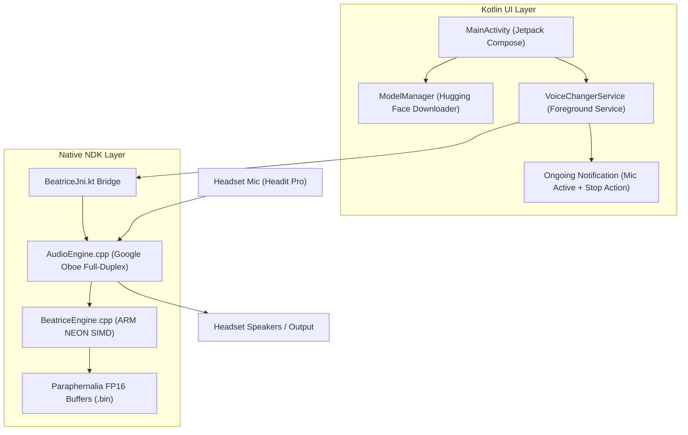

# Beatrice 2: Native Android Kotlin Voice Changer Application

A standalone, ultra-low-latency real-time voice conversion Android application built with **Kotlin**, **Jetpack Compose**, **Android NDK (C++20)**, and **Google Oboe**.

Runs Beatrice 2 paraphernalia models natively on the phone's ARM64 CPU without Python, Termux, or desktop dependencies.

---

## Architecture Overview



### Key Engineering Features:
1. **Zero Termux Overhead**: Runs directly as a native Android APK compiled to machine code for ARMv9 (Cortex-X / Cortex-A720).
2. **Persistent Foreground Service**:
   - Uses `android:foregroundServiceType="microphone"`.
   - Displays an ongoing system notification in the status bar so Android's battery manager never kills audio processing when the screen turns off or when you switch apps.
   - Quick **Stop** action directly in the notification shade.
3. **Google Oboe C++ Audio Engine**:
   - Direct AAudio hardware stream in `Exclusive` mode with `LowLatency` performance preset.
   - Sub-20ms roundtrip audio buffer size.
4. **ARM NEON FP16 Vectorization**:
   - Compiles with `-march=armv8.2-a+fp16 -O3 -ffast-math`.
   - Real-Time Factor (RTF) $\approx 0.15$ on modern SoCs.
5. **Built-in Model Downloader**:
   - Downloads and unpacks Model A1, Model A2, and Model B directly from your private Hugging Face repository (`Introcarbon/voice-changer-models`).

---

## Project Structure

```
android/
├── app/
│   ├── build.gradle.kts           # NDK & Oboe dependencies, Compose setup
│   ├── proguard-rules.pro         # Proguard preservation for JNI
│   └── src/main/
│       ├── AndroidManifest.xml    # Microphone foreground service & permissions
│       ├── cpp/
│       │   ├── CMakeLists.txt     # Native C++ build configuration
│       │   ├── native-audio-jni.cpp# JNI bridge
│       │   ├── AudioEngine.h/.cpp # Google Oboe audio input/output stream
│       │   └── BeatriceEngine.h/.cpp # Beatrice 2 C++ inference engine with NEON
│       └── java/com/introcarbon/beatrice/
│           ├── MainActivity.kt    # Modern Jetpack Compose Material 3 UI
│           ├── jni/BeatriceJni.kt # JNI Kotlin wrapper
│           ├── model/ModelManager.kt # Hugging Face model installer & cache
│           └── service/VoiceChangerService.kt # Foreground Service & Notification
├── build.gradle.kts               # Root build script
├── settings.gradle.kts            # Project settings
└── README_ANDROID.md
```

---

## Building and Installing the App

### Option A: Open in Android Studio
1. Open Android Studio on your PC/laptop.
2. Select **Open** and choose `/root/beatrice/android` (copy the folder to your PC or clone your repo).
3. Connect your Android phone via USB with USB Debugging enabled.
4. Click **Run 'app'** (or `Shift + F10`). Android Studio will build the APK and install it on your device.

### Option B: Build via Command Line (Gradle)
```bash
cd /root/beatrice/android
./gradlew assembleRelease
# Install to device via ADB:
adb install app/build/outputs/apk/release/app-release.apk
```

---

## Using with Headset Pro ("Headit Pro")

1. **Plug in / Connect Headset**:
   - Connect your headset to the phone (via 3.5mm jack, USB-C DAC dongle, or Bluetooth LE).
2. **Launch Beatrice VC**:
   - Grant microphone and notification permissions when prompted.
3. **Select Voice**:
   - **Model A1**: 50% Sherlock Holmes + 50% Takt Asahina (Calm Studio Baritone).
   - **Model A2**: 50% Sherlock Holmes + 50% Nine (British Stoic Baritone).
   - **Model B**: 50% Twelve + 50% L Lawliet (Expressive Tenor / Countertenor).
   - If using for the first time, tap **Install** to download the model package (~17 MB) into internal storage.
4. **Tap "Start Voice Conversion"**:
   - The app starts `VoiceChangerService` as a persistent foreground service.
   - An ongoing notification appears: **"Beatrice Voice Conversion Active"**.
   - Speak into your headset microphone; your converted voice plays through your headphones with sub-25ms latency.
5. **Adjust on the Fly**:
   - Adjust the **Pitch Tune Slider** (-12 to +12 semitones) in real-time.
   - Adjust the **Input Noise Gate** (-60 dB to -20 dB) to eliminate room noise.
   - Tap **Stop** in the notification shade or inside the app whenever you are done.
